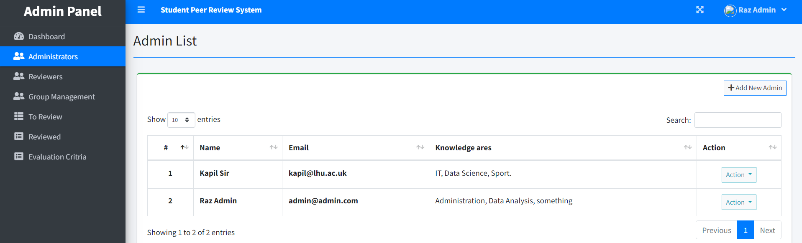
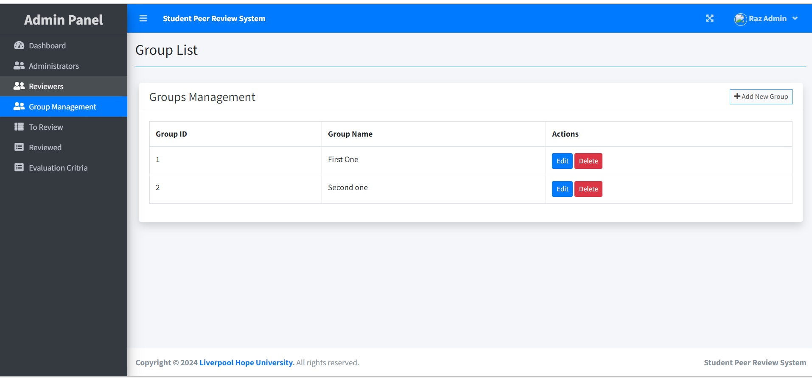
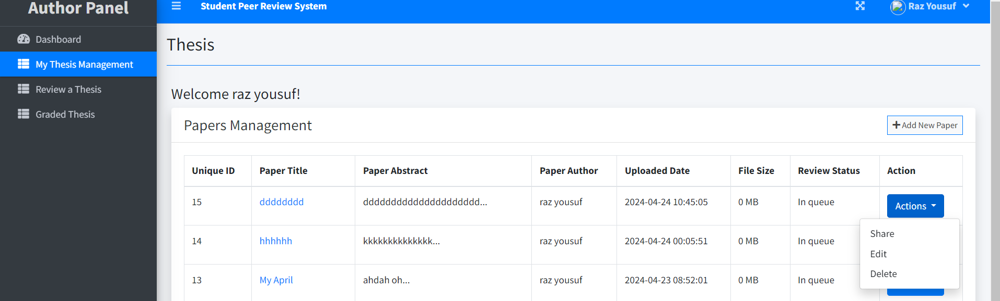
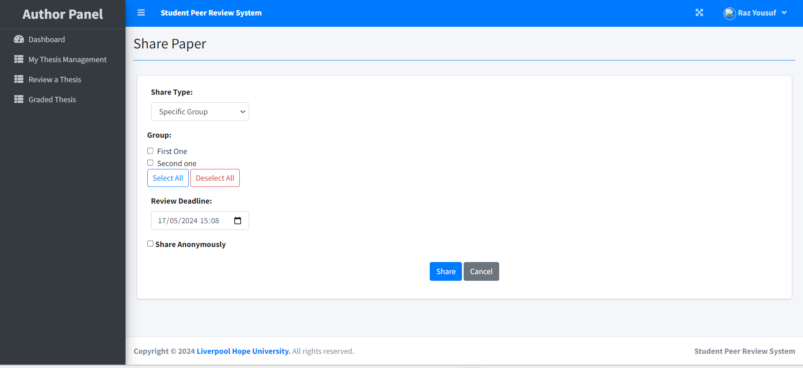
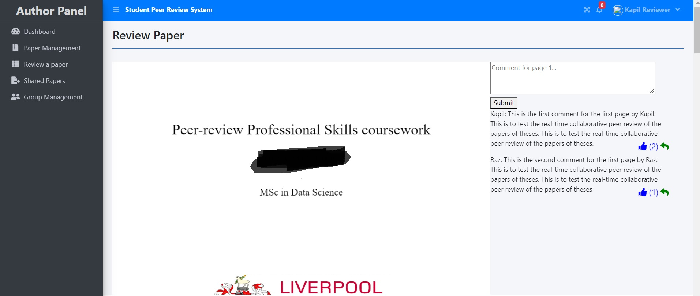
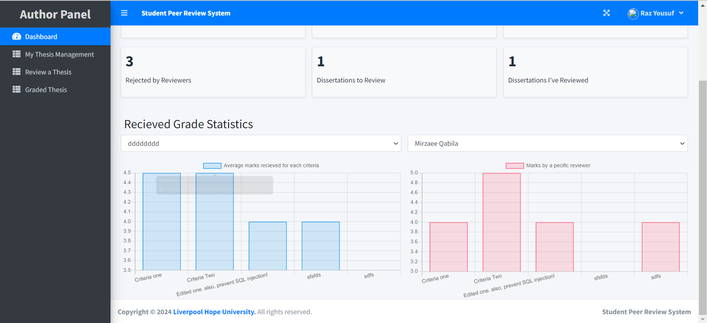

# Student Collaborative Peer Review System (SCPRS)

Welcome to the Student Collaborative Peer Review System (SCPRS) GitHub repository! SCPRS is an innovative platform designed to facilitate the peer review process for student research papers and theses. By leveraging the collaborative power of students, SCPRS aims to enhance the quality of academic submissions and foster a deeper understanding of academic standards and methodologies.

## Table of Contents

- [Introduction](#introduction)
- [Features](#features)
- [Getting Started](#getting-started)
  - [Prerequisites](#prerequisites)
  - [Installation](#installation)
  - [Usage](#usage)
- [Contributing](#contributing)
- [License](#license)
- [Contact](#contact)

## Introduction

The Student Collaborative Peer Review System (SCPRS) is designed to transform the traditional peer review process into a collaborative, student-driven experience. It enables students to engage in multiple rounds of peer review, providing and receiving constructive feedback on research papers and theses. This system not only improves the quality of individual research but also helps students develop critical skills such as analytical thinking, constructive criticism, and academic writing.

## Features

- **Collaborative Reviews**: Engage in multiple rounds of peer review with your classmates.
- **Structured Rubrics**: Utilize comprehensive rubrics for consistent and thorough evaluations.
- **Interactive Feedback**: Facilitate discussions between reviewers and authors for deeper insights.
- **User-Friendly Interface**: Easy-to-use platform designed with students in mind.
- **Scalable Solution**: Efficiently manage peer reviews for a large number of students.

## Getting Started

### Prerequisites

Before you begin, ensure you have met the following requirements:
- You have installed [XAMPP](https://www.apachefriends.org/index.html), which includes Apache and MySQL/MariaDB.
- You have administrative privileges to install packages and manage databases.

### Installation

To install SCPRS, follow these steps:

1. **Clone the Repository**

   ```bash
   git clone https://github.com/razyousuf/scprs.git
   cd scprs
   ```
2. **Set Up Database**
  * Start XAMPP and ensure Apache and MySQL are running.
  * Open [phpMyAdmin](http://localhost/phpmyadmin) and create a new database named `sprs`.
  * Open the database in an editor like notepad++ and verify/or replace the collate suitable for your DBMS versoin (now the collate is set to the `utf8mb4_unicode_520_ci`).
  * Import the `sprs.sql` file located in the `database` folder into your newly created database:
     - In phpMyAdmin, select the `sprs` database.
     - Click on the `Import` tab.
     - Click `Choose File` and select the `sprs.sql` file from the `database` folder.
     - Click `Go` to import the database structure and data.

3. **Configure Environment**
    - Open the file `db_connect.php`.
    - Update the file with your database credentials:
  
     ```
     <?php
        $conn= new mysqli('localhost','root','','sprs')
     ?>
     ```

4. **Run the Application**
    - Move the project folder to the htdocs directory in your XAMPP installation.
    - Open your web browser and navigate to http://localhost/sprs.


### Usage
Once the application is running, you can access it through your web browser. Here’s a quick guide to getting started:

1. **Login and Create Account:** (username: admin@admin.com, password: 123) and create some new users with type 2 (reviewer).
   
3. **Create a Review Group:** Set up a group for your class or research team.
  
5. **Submit Your Paper:** Upload your research paper or thesis for review.
  
7. **Share Your Paper:** Share the paper with your group or a specific reviewer(s)
  
9. **Review Peers:** Engage in peer review using the provided rubrics.
  
11. **Receive Feedback:** View- or respond to feedbacks received from your peers.
  

### Contributing
To contribute to SCPRS, follow these steps:

1. **Fork the Repository**
 ```
   git fork https://github.com/razyousuf/scprs.git
 ```

2. **Create a Feature Branch**
   ```
   git checkout -b feature/your-feature-name
   ```
3. **Commit Your Changes**
  ```
   git commit -m 'Add some feature'
  ```
5. **Push to the Branch**
  ```
   git push origin feature/your-feature-name
  ```
6. **Create a Pull Request**
  - Submit your pull request for review.

### Contact
If you have any questions or need further assistance, please contact us at:
  * Email: razyousufi350@gmail.com
  * Linkedin: www.linkedin.com/in/raz-y-0998492a3
  * GitHub Issues: [https://github.com/razyousuf/](https://github.com/razyousuf/)

We appreciate your feedback and contributions to the Student Collaborative Peer Review System (SCPRS)!
Thank you for using SCPRS. Together, we can make academic peer review more collaborative, inclusive, and effective!

**acknowledgement:** Special thanks to Dr. Kapil Dev and Dr. Neil Buckley for their insightful guidance and comments throughout the project. Also, thanks to [Liverpool Hope University](https://www.hope.ac.uk/) for financial- and non-financial supports towards completion of this project.
